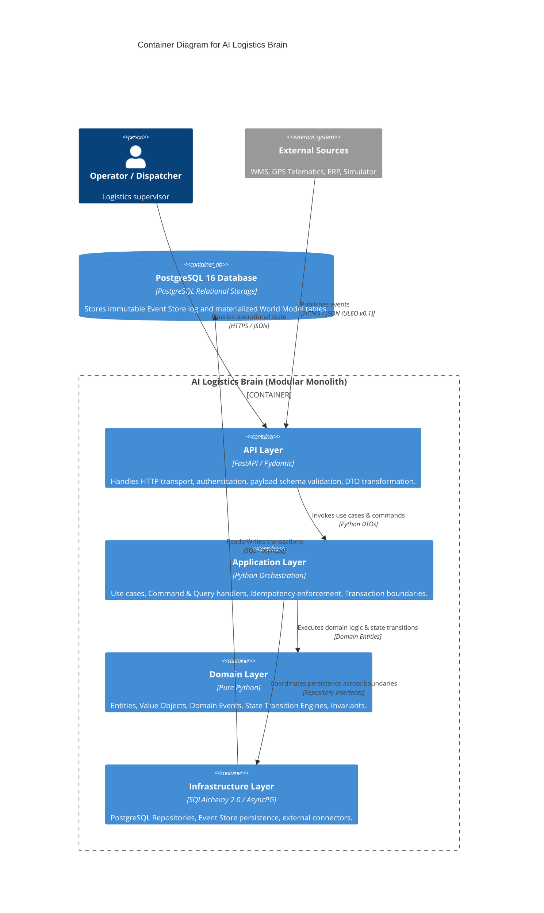

# C4 Level 2: Container Architecture — AI Logistics Brain

The **Container Architecture** diagram decomposes the AI Logistics Brain into its runtime executable units and internal architectural layers.



---

## Layer Responsibilities & Strict Boundaries

```text
       ┌───────────────────────────────┐
       │           API Layer           │  ← FastAPI, Pydantic DTOs, HTTP error mapping
       └───────────────┬───────────────┘
                       │
       ┌───────────────▼───────────────┐
       │       Application Layer       │  ← Commands, Queries, Idempotency, Tx boundaries
       └───────┬───────────────┬───────┘
               │               │
  ┌────────────▼──────────┐ ┌──▼────────────────────────────┐
  │     Domain Layer      │ │      Infrastructure Layer     │  ← Repositories, Event Store,
  │ (Pure Business Logic) │ │   (SQLAlchemy, AsyncPG, DB)   │     PostgreSQL connections
  └───────────────────────┘ └───────────────────────────────┘
```

1. **API Layer (`src/api`)**:
   * Accepts incoming HTTP requests.
   * Enforces schema conformance (ULEO v0.1 format).
   * Transforms raw JSON into typed Application Commands.
2. **Application Layer (`src/application`)**:
   * Checks event idempotency (`event_id` uniqueness check).
   * Loads current domain aggregate state via repository interfaces.
   * Dispatches domain methods.
   * Commits the immutable event to the Event Store and updates materialized state atomically.
3. **Domain Layer (`src/domain`)**:
   * **100% Pure Python**: No imports from FastAPI, SQLAlchemy, PostgreSQL, or Pydantic.
   * Encapsulates state machines (e.g. `ParcelStatus`, `TruckStatus`).
   * Validates invariants (e.g., cannot deliver a parcel that was never loaded).
4. **Infrastructure Layer (`src/infrastructure`)**:
   * Implements repository interfaces defined by application/domain layers.
   * Maps domain models to relational database tables using SQLAlchemy 2.0.
   * Handles database connections, connection pooling, and migrations.
