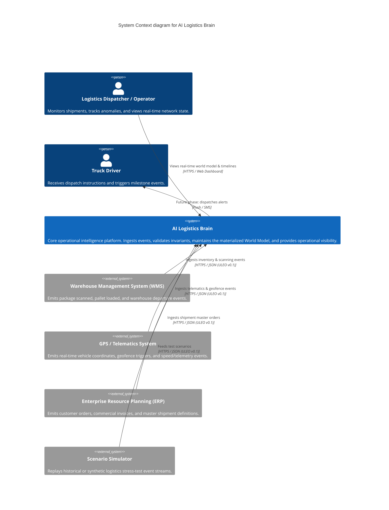

# C4 Level 1: System Context — AI Logistics Brain

The **System Context** diagram illustrates how the AI Logistics Brain fits into the broader logistics operational ecosystem.

---

## External Actors & Systems

| Actor / System | Role & Responsibility | Interaction with Logistics Brain |
|---|---|---|
| **Warehouse Management System (WMS)** | Manages bin locations, picking, packing, sorting | Sends `PARCEL_SCANNED`, `CONTAINER_PACKED` events |
| **GPS / Telematics System** | On-truck IoT devices tracking location & speed | Sends `TRUCK_LOCATION_PING`, `GEOFENCE_ENTERED` events |
| **ERP / OMS** | Commercial and order master data | Sends `ORDER_CREATED`, `SHIPMENT_MANIFESTED` events |
| **Scenario Simulator** | Synthetic generator for load testing & chaos simulation | Streams ULEO v0.1 event batches for evaluation |
| **Logistics Dispatcher** | Human operational supervisor | Queries current World Model, monitors state transitions |
